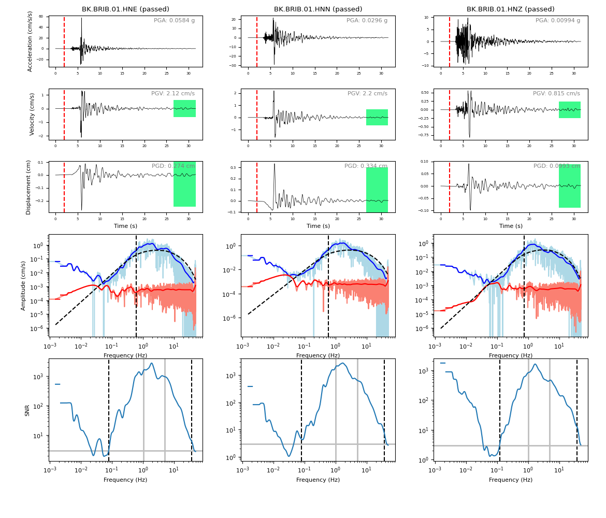
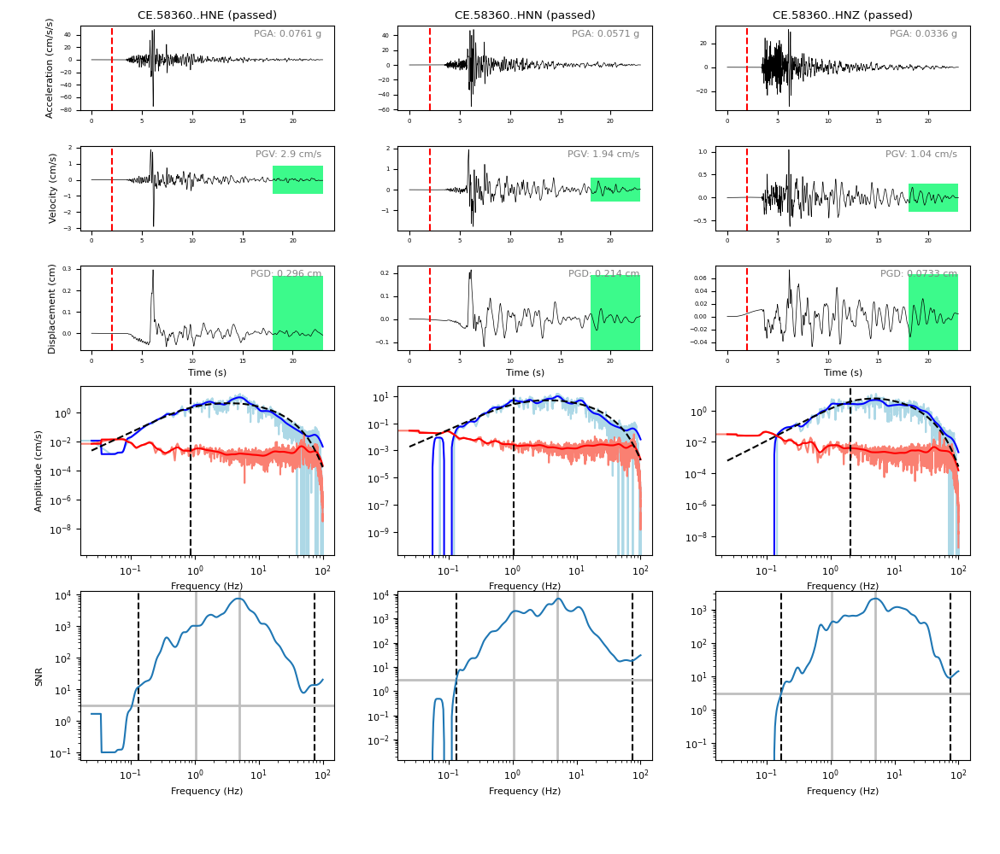
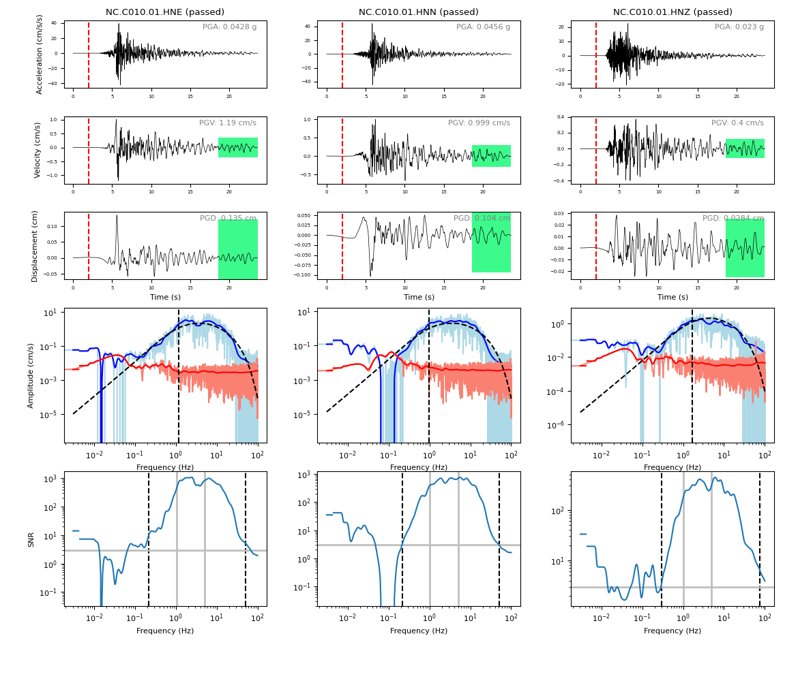
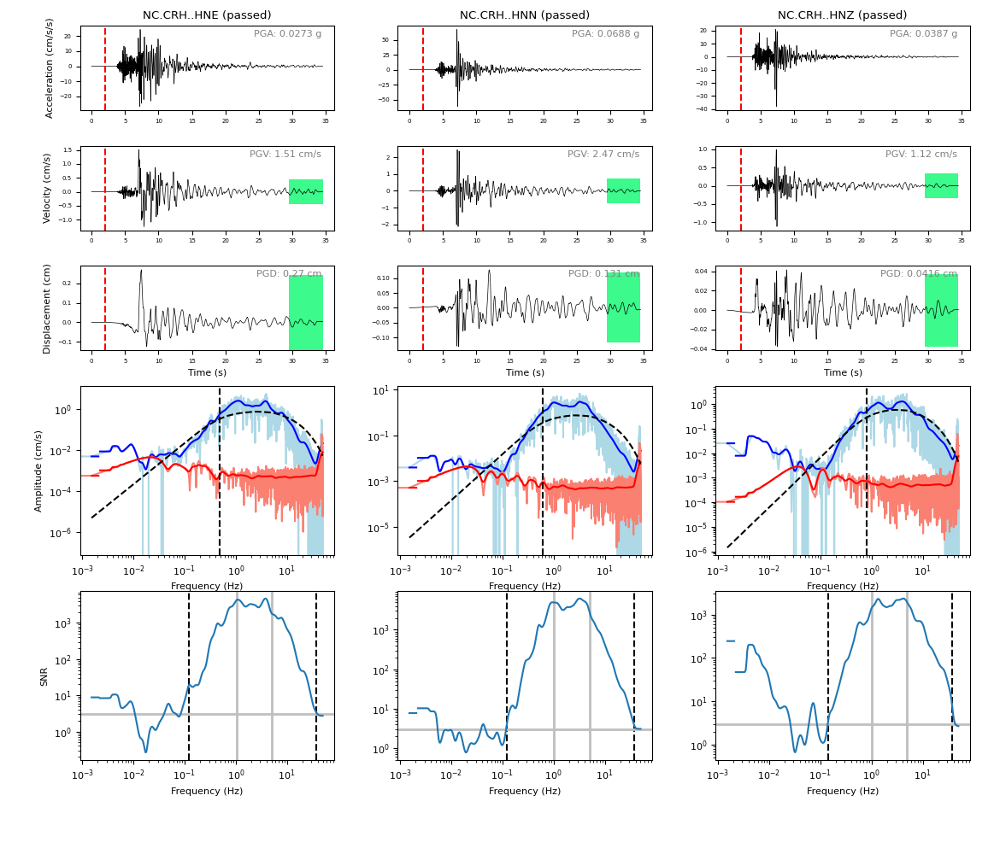
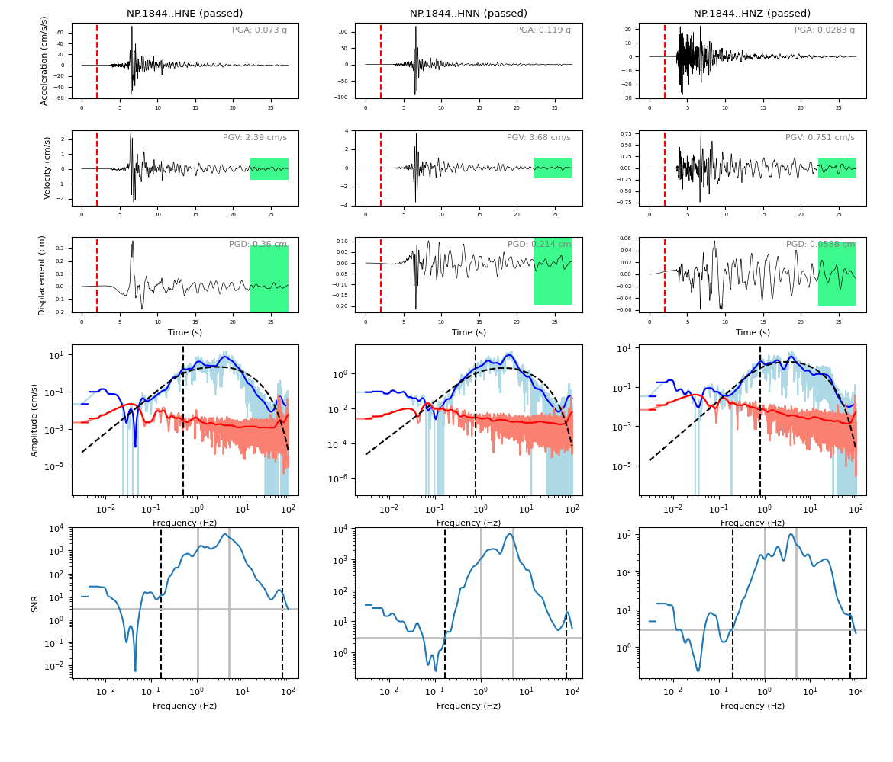

# Command Line Interface

This example covers using the `gmrecords` command line program in a typical workflow for downloading, processing, and generating products for ground-motion records from an earthquake.

```{seealso}
Be sure to review the discussion of all of the `gmrecords` subcommands in section {ref}`gmrecords` and configuring projects in section {ref}`Initial Setup`.
```

## Local `gmprocess` configuration

In this example we specify parameters in the project configuration to produce a small dataset.
We use only the FDSN fetcher and limit the station distance to 0.1 degrees.
The configuration files are in the `conf/cli` directory.
First, we first create the project `data` directory, and then we use the `projects` subcommand to select the project configuration `cli-tutorial` from the tutorial projects listed in the `.gmprocess/projects.conf` file.

:::{command-output} mkdir -p data/cli data/scripting
---
cwd: .
---
:::

:::{command-output} gmrecords projects --switch cli-tutorial
---
cwd: .
---
:::

At this point we have an empty `data/cli` directory.
The `conf/cli` directory has two files: `fetchers/yml` and `user.yml`.
These configuration files hold parameters that override default values provided with the source code.
See [Configuration File](../manual/config_file) for more information.

## Download Data

In this example we will consider ground motions recorded for a [magnitude 4.5 earthquake](https://earthquake.usgs.gov/earthquakes/eventpage/nc73291880/executive) east of San Francisco, California.

```{tab} Download
We download data from FDSN data centers using the USGS ComCat event ID nc73291880.

`gmrecords download --eventid nc73291880`
```

```{tab} Use cached data
We have cached the results of running `gmrecords download --eventid nc73291880` in the `tests/data/tutorials` directory.
Consequently, we simply copy the data from `tests/data/tutorials/nc73291880` to `data/cli/nc73291880`.

:::{command-output} cp -r ../../../tests/data/tutorials/nc73291880 data/cli/
---
cwd: .
---
:::

```

### List Data

We now have earthquake rupture information and raw waveforms in the `data/cli` directory.

:::{command-output} tree data/cli
---
cwd: .
---
:::

From the directory tree above, you can see how `gmrecords` organizes the data directory:

- within the root data directory there are subdirectories for each event named
  by the event ID,

- within each event directory there is

  - an `event.json` file that stores event information that were retrieved
    from the USGS data,

  - a `raw` directory that holds the downloaded raw data. In this case, that
    consists of miniseed and StationXML files,

    - The downloaded data is contained within the `raw` directory.
    - The `raw` directory also has PNG files that are plots of the raw data.

  - a `rupture.json` file that includes information about the rupture extent.

## Assemble Data

The `assemble` subcommand collects the data in the raw directory and organizes it into an ASDF file.
If we do not specify the event ID, then all of the events in the data directory will be assembled.

:::{command-output} gmrecords assemble
---
cwd: .
---
:::

The console message indicates that the `workspace.h5` ASDF file has been created.

```{note}
The [Seismic Data](https://seismic-data.org/) folks have developed a graphical user interface to explore ASDF data sets called [ASDF Sextant](https://github.com/SeismicData/asdf_sextant) and this may be useful for browsing the contents of the ASDF file.
Since ASDF is an HDF5 specification, it can also be loaded in most programming languages using [HDF5](https://www.hdfgroup.org/solutions/hdf5/ libraries.
```

## Process Waveforms

The `process_waveforms` (or just `process` for short) subcommand reads in the raw data from the ASDF workspace files that were created by the assemble subcommand, and then applies the waveform processing steps that are specified the config file (in the processing section).
The processed waveforms are then added to the ASDF workspace file.

:::{command-output} gmrecords process_waveforms
---
cwd: .
---
:::

Note that the console messages indicate that some of the traces failed due to clipping or signal-to-noise requirements.

## Generate Report

The `generate_report` subcommand will generate a PDF report for each earthquake.
The report is useful to review which streams failed and why.
The report gives a 1-page summary per station that includes:

- the acceleration, velocity, and displacement plots,
- the location where the signal and noise windows were split,
- the signal and noise spectra (raw and smoothed), and
- a table of the processing steps applied to the record.
- the failure reason for stations that have failed.
- shaded green regions that show range in acceptable amplitudes in the tail of the trace for a "sanity" check; this check is designed to remove records with unnatural drifts in the waveform.

:::{command-output} gmrecords gnerate_report
---
cwd: .
---
:::

We show plots from the summaries for 5 stations.

```{tab} BK.BRIB

```

```{tab} CE.58360

```

```{tab} NC.C010

```

```{tab} NC.CRH

```

```{tab} NP.1844

```

### Report Explanation

The full report for each station also includes the provenance table and failure reason (not shown here).
The **first row** of plots is the acceleration time series, the **second row** of plots is the velocity time series, and the **third row** of plots is the displacement time series.
The vertical dashed red line indicates the boundary between the signal and noise windows.
The **fourth row** of plots gives the raw and smoothed Fourier amplitude spectra, where the dashed black curve is a Brune spectra fit to the data, and the vertical dashed line is the corner frequency.
The **fifth row** of plots is the signal-to-noise ratio (SNR), where the vertical grey lines indicate the band where the SNR criteria are required, the horizontal grey line is the minimum SNR, and the vertical black dashed lines are the selected bandpass filter corners.

## Compute Station Metrics

The `compute_station_metrics` subcommand computes station metrics (like epicentral distance) and add them to the ASDF workspace file.

:::{command-output} gmrecords compute_station_metrics
---
cwd: .
---
:::

## Compute Waveform Metrics

The `compute_waveform_metrics` subcommand computes waveform metrics (such as spectral accelerations) and adds them to the ASDF workspace file.
The waveform metrics that are computed are defined in the metrics section of the conf file.
The metrics are defined by intensity metric types (for example, spectral acceleration vs duration) and intensity measure component (how the instrument components are combined).

:::{command-output} gmrecords compute_waveform_metrics
---
cwd: .
---
:::

:::{note}
Waveform metrics will not be computed for stations that do not pass the quality checks.
:::

## Export Failure Tables

It is useful to summarize the reasons that records have failed the QA checks, and this information can be output in a spreadsheet using the `export_failure_tables` subcommand.
Unlike many of the other subcommands, the output combines the results in all project events and puts the result into the base project directory.

:::{command-output} gmrecords export_failure_tables
---
cwd: .
---
:::

## Export Metric Tables

Although the metrics can be accessed directly from the ASDF file, it is often convenient to save the metrics (both station and waveform) into a "flatfile" where each row corresponds to a single record.

:::{command-output} gmrecords export_metric_tables
---
cwd: .
---
:::

Note that the metric tables are organized into separate files for each intensity measure component (i.e., "IMT").

## Export Provenance Tables

As with the metric and failure tables, you can also output tables summarizing the provenance information.

:::{command-output} gmrecords export_provenance_tables
---
cwd: .
---
:::

## Generate Regression Plot

Although the report created by the `generate_report` subcommand is helpful for checking for some possible processing problems, it cannot identify outliers that may be due to incorrect metadata (such as the gain).
This type of issue is relatively common, and can sometimes be identified by plotting the peak ground acceleration as a function of distance.

:::{important}
You must run the `export_metric_tables` before running `generate_regression_plot`.
:::

:::{command-output} gmrecords generate_regression_plot
---
cwd: .
---
:::

An example is given below, but for this plot we re-ran the above commands with a larger maximum station radius (0.8 degrees) to make the plot look a little bit more interesting than it looks for a small dataset.

```{figure} ../../_static/regression_rotd50.0_PGA.png
Peak ground acceleration versus epicentral distance for expanded dataset (max station distance of 0.8 degrees).
```

## Station Map

The `generate_station_maps` command makes an interactive HTML map that can be opened in a browser.

:::{command-output} gmrecords generate_station_maps
---
cwd: .
---
:::

<figure class="align-default" id="int_stn_map">
   <iframe
      src="../../_static/stations_map.html"
      title="Example interactive station map"
      style="width:100%; height:300px;"
   ></iframe>

   <figcaption>
      <p>
         <span class="caption-text">Example interactive station map.</span>
         <a class="headerlink" href="#int_stn_map" title="Permalink to this image">#</a>
      </p>
   </figcaption>
</figure>

% Indices and tables

% ==================

% * :ref:`genindex`

% * :ref:`modindex`

% * :ref:`search`
