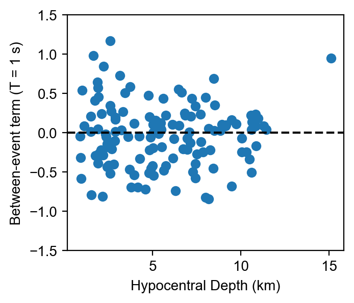

Linear Mixed Effects Regressions
===========================================

After assembling a ground motion database with gmprocess, linear mixed effects
models can be used to analyze trends in the data
(https://www.statsmodels.org/stable/mixed_linear.html). In this tutorial,
we will read in some sample ground motion data, compute residuals relative to a
ground motion model, and perform a linear, mixed effects regression to estimate
the between- and within-event terms.

First, we import the necessary packages:

.. code-block:: python

    import numpy as np
    import pandas as pd
    import matplotlib.pyplot as plt
    import statsmodels.formula.api as smf

    from openquake.hazardlib.imt import SA
    from openquake.hazardlib.gsim.base import SitesContext
    from openquake.hazardlib.gsim.base import RuptureContext
    from openquake.hazardlib.gsim.base import DistancesContext
    from openquake.hazardlib.gsim.abrahamson_2014 import AbrahamsonEtAl2014

The statsmodels package will need to be installed separately
(https://www.statsmodels.org/stable/install.html) as it is not installed by
default in the gmprocess environment.

Next, we will read in the ground motion data. We are using a ground motion dataset of
earthquakes from the 2019 Ridgecrest, California Earthquake Sequence. If you would like
to follow along with this tutorial, you can download the data
`here <https://www.strongmotioncenter.org/specialstudies/rekoske_2019ridgecrest/SA_rotd50.0_2020.03.31.csv>`_.

.. code-block:: python

    df = pd.read_csv('SA_rotd50.0_2020.03.31.csv')

We then initialize the ground motion model and intensity measure type (IMT).
For this tutorial, we will use the ASK14 ground motion model and the
1.0-second response spectra.

.. code-block:: python

    gmm = AbrahamsonEtAl2014()
    imt = SA(1.0)

We will then loop over all earthquakes and compute the predicted data using
ASK14. To evaluate the GMM, we must make some assumptions regarding the rupture
properties (dip, rake, width, ztor) and site properties (Vs30, Z1).

.. code-block:: python

    predicted_data = []

    # Loop over each earthquake
    for eqid in df.EarthquakeId.unique():
        df_eq = df[df.EarthquakeId == eqid].copy()
        n = df_eq.shape[0]

        # Create rupture, sites, and distances contexts for evaluating the GMM
        rx = RuptureContext()
        rx.dip = 90
        rx.rake = 0
        rx.mag = df_eq.EarthquakeMagnitude.iloc[0]
        rx.width = 10**(-0.76 + 0.27 * rx.mag)
        rx.ztor = df_eq.EarthquakeDepth.iloc[0]

        sx = SitesContext()
        sx.vs30 = np.full(n, 760)
        sx.vs30measured = np.full(n, False)
        sx.z1pt0 = np.full(n, 48)

        dx = DistancesContext()
        dx.rjb = df_eq.JoynerBooreDistance
        dx.rrup = df_eq.RuptureDistance
        dx.rx = np.full(n, -1)
        dx.ry0 = np.full(n, -1)

        # Evaluate the GMM
        mean, sd = gmm.get_mean_and_stddevs(sx, rx, dx, imt, [])

        # Convert from ln(g) to %g
        mean = 100 * np.exp(mean)

        # Store the predicted data in a list
        predicted_data += mean.tolist()

Next, we compute the residuals between the observed and predicted data:

.. code-block:: python

    resid_col = 'SA_1_ASK14_residuals'
    df[resid_col] = np.log(df['SA(1.000)']) - np.log(predicted_data)

We are now ready to perform the linear mixed effects regression. We use the
'EarthquakeId' column to group the data by event to compute the between-event
and within-event terms. We initalize and fit the linear mixed effects model
with statsmodels using the following syntax:

.. code-block:: python

    mdf = smf.mixedlm('%s ~ 1' % resid_col, df, groups=df['EarthquakeId']).fit()

We can see a quick summary of the regression results with

.. code-block:: python

    print(mdf.summary())

.. code-block:: console

                Mixed Linear Model Regression Results
    ==================================================================
    Model:            MixedLM Dependent Variable: SA_1_ASK14_residuals
    No. Observations: 22375   Method:             REML
    No. Groups:       131     Scale:              0.6680
    Min. group size:  1       Log-Likelihood:     -27457.3530
    Max. group size:  767     Converged:          Yes
    Mean group size:  170.8
    ---------------------------------------------------------------------
                Coef.    Std.Err.      z      P>|z|    [0.025    0.975]
    ---------------------------------------------------------------------
    Intercept     0.036       0.046    0.771    0.441    -0.055     0.126
    Group Var     0.245       0.045
    ==================================================================

As seen, our model indicates a bias (intercept) of 0.036. We can also look at
the between-event terms with

.. code-block:: python

    print(mdf.random_effects)

.. code-block:: console

    {'ci37219172': Group   -0.243347
    dtype: float64, 'ci37219180': Group    0.449234
    dtype: float64, 'ci37219476': Group    0.237103
    dtype: float64, 'ci37219516': Group   -0.57304
    dtype: float64, 'ci37219556': Group   -0.163552
    dtype: float64, 'ci37219580': Group    0.0437
    ...

and the within-event terms with

.. code-block:: python

    print(mdf.resid)

.. code-block:: console

    0       -0.240723
    1       -0.563343
    2       -0.248569
    3        0.847873
    4       -0.781516
            ...
    22370   -1.759840
    22371    0.187622
    22372   -1.260160
    22373    0.972692
    22374    0.080163
    Length: 22375, dtype: float64

Now that we have computed the between- and within-event terms, we show how to
merge the computed terms with the original database, and look at the
between-event terms as a function of hypocentral depth, as an example.

.. code-block:: python

    btw_event_terms = pd.DataFrame(mdf.random_effects).T
    df = df.merge(btw_event_terms, left_on='EarthquakeId', right_index=True)
    df_events = df.drop_duplicates(subset=['EarthquakeId'])

    plt.scatter(df_events['EarthquakeDepth'], df_events['Group'])
    plt.xlabel('Hypocentral Depth (km)')
    plt.ylabel('Event term (T = 1 s)')
    plt.axhline(0, ls='--', c='k')
    plt.ylim(-1.5, 1.5)
    plt.show()

