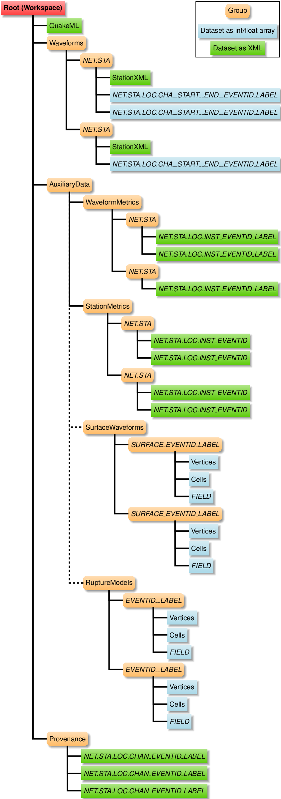

# Workspace

We use the term "workspace" to refer to the HDF file that serves as a
container to hold the inputs, important intermediate results, and
outputs. It also includes provenance information describing the processing
steps performed on the data.

The [ASDF](https://academic.oup.com/gji/article/207/2/1003/2583765)
HDF-5 layout includes specifications for earthquake information,
station metadata, and waveform time histories. We include information
not explicitly covered in the ASDF format specification in the
`AuxiliaryData` group.

## Nomenclature

For many of the groups and datasets in the HDF file, we form the names
by concatenating station information, such as network code, station
code, location code, channel code, and event id. Additionally, ASDF
supports tags for differentiating `Waveforms` and `AuxiliaryData`. In
our extension of the ASDF layout, we create the tags based on the
station and event information along with a user-specified label. In
the following sections, we use the following variables (denoted by
italics) in the group and dataset names:

  * ***NET***: FDSN network code (or equivalent);
  * ***STA***: Station code;
  * ***LOC***: Location code;
  * ***CHA***: SEED channel code (or equivalent);
  * ***INST***: First two letters of the channel code (dropping the third letter which corresponds to the component);
  * ***START__END***: Channel start and end timestamps for `Waveforms`; and
  * ***LABEL***: User-specified label that uniquely identifies processing parameters;
  * ***EVENTID***: ComCat event id (or equivalent)

The ASDF schema requires tags and `AuxiliaryData` paths to be
letters, numbers, and underscores. This means that we use underscores
in place of the periods we usually use between network, station,
channel, and location codes.

## Extension of ASDF HDF-5 Layout

We add several additional groups to the `AuxiliaryData` section:

* `WaveformMetrics` for ground-motion intensity metrics, such as peak
values, response spectra, and Fourier amplitude spectra.

* `StationMetrics` for event station information, such as epicentral
distance and rupture distance.

* `TraceProcessingParameters` for parameters associated with the
  waveform trace processing.

* `SteamProcessingParameters` for parameters associated with
  processing the channels for a station.

* `AuxArrays` for noise and signal spectra, including smoothed signal
  spectra.

* (Potential future addition) `SurfaceWaveforms` for waveform time histories
  on a surface.

* (Potential future addition) `RuptureModels` for finite-fault earthquake
  rupture models.


<figure>
  
  <figcaption>Diagram of group and dataset hierarchy in extension of the
ASDF HDF-5 layout</figcaption>
</figure>


### Waveform Metrics

Waveform metrics are quantities derived from the waveform time
histories, such as peak values (maximum absolute values), duration,
response spectra, and Fourier amplitude spectra. Although in some
cases they may be associated with a single channel (for example,
maximum absolute value) they are often a scalar value associated with
multiple channels (for example, RotD50 from the channels with the
horizontal components).

#### Waveform Metrics Hierarchy

Following the ASDF layout for waveforms and station metadata, the
hierarchy is

`WaveformMetrics` (group) -> *NET_STA* (group)
-> *NET_STA_LOC_INST_EVENTID_LABEL* (dataset)

We use the instrument code (first two letters of the channel code)
rather than the full channel code, because many metrics involve
multiple channels (horizontal components). The components are included
in the metrics as attributes as necessary.

The dataset is a byte string corresponding to XML, similar to the
`QuakeML` and `StationXML` datasets.

The XML hierarchy follows the ShakeMap convention of intensity metric
followed by intensity metric type (`waveform_metrics` -> *IM* -> *IMT*).

  * **IM**: Intensity metric (peak ground acceleration, peak ground
velocity, response spectra, Fourier amplitude spectra)
  * **IMT**: Intensity metric type (maximum component, geometric mean,
RotD50, etc)

Sample XML for a waveform metrics dataset:
```xml
<waveform_metrics>
    <pga>
        <rot_d50 units="m/s**2">0.45</rot_d50>
        <maximum_component units="m/s**2">0.23</maximum_component>
        <component name="east" units="m/s**2">0.23</component>
        <component name="up" units="m/s**2">0.11</component>
    </pga>
    <sa percent_damping="5.0">
        <rot_d50 units="g">
	        <value period="3.0">0.2</value>
	        <value period="1.0">0.6</value>
	        <value period="0.3">0.3</value>
        </rot_d50>
    </sa>
    <pgv>
        <maximum_component units="m/s">0.012</maximum_component>
        <component name="east" units="m/s">0.012</component>
        <component name="up" units="m/s">0.008</component>
    </pgv>
</waveform_metrics>
```

### Station Metrics

Station metrics are quantities that depend on the earthquake rupture
and station, such as epicentral distance, hypocentral distance,
Joyner-Boore distance, and closest distance to the rupture surface.

#### Station Metrics Hierarchy

Following the ASDF layout for waveforms and station metadata, the
hierarchy is

`StationMetrics` (group) -> *NET_STA* (group)
-> *NET_STA_LOC_INST_EVENTID* (dataset)

The dataset is a byte string corresponding to XML, similar to the
`QuakeML` and `StationXML` datasets.

Sample XML for a station metrics dataset:
```xml
<station_metrics>
  <hypocentral_distance units="km">10.2</hypocentral_distance>
  <epicentral_distance units="km">2.3</epicentral_distance>
</station_metrics>
```

### Trace Processing Parameters

Trace processing parameters are the parameters for the algorithms used
to process the individual waveform traces. This information is
primarily intended for reproducibility.

#### Trace Processing Parameters Hierarchy

Following the ASDF layout for waveforms, the
hierarchy is

`TraceProcessingParameters` (group) -> *NET_STA* (group)
-> *NET_STA_LOC_CHA_EVENTID_LABEL* (dataset)

The dataset is a byte string corresponding to JSON. 

Sample JSON for a trace processing parameters dataset:
```json
{
  "baseline": {
    "polynomial_coefs": [
      -3.1244715639196995e-24,
       1.1046838180719736e-19,
      -1.2610591147149431e-15,
       4.223265643969671e-12,
       7.099592013855652e-09,
       0,
       0
    ]
  }, 
  "corner_frequencies": {
      "type": "snr", 
	  "lowpass": 30.778610333622925, 
	  "highpass": 0.008053637150713472
  }, 
  "snr_conf": {
    "threshold": 3.0, 
	"min_freq": 1.5, 
  	"bandwidth": 20.0, 
    "max_freq": 5.0
  }, 
  "signal_split": {
    "picker_type": "travel_time", 
    "method": "p_arrival", 
    "split_time": "2019-07-06T03:20:46.346556Z"
  }, 
  "signal_end": {
    "vsplit": 1.0, 
	"floor": 120, 
	"epsilon": 2.0, 
	"end_time": "2019-07-06T03:23:09.315515Z", 
	"model": "AS16", 
	"method": "model"
  }
}
```

### Stream Processing Parameters

Stream processing parameters are the parameters for the algorithms
used in processing involving multiple channels for a station for a
given earthquake. This information is primarily intended for
reproducibility.

#### Stream Processing Parameters Hierarchy

Following the ASDF layout for waveforms, the
hierarchy is

`StreamProcessingParameters` (group) -> *NET_STA* (group)
-> *NET_STA_LOC_INST_EVENTID_LABEL* (dataset)

The dataset is a byte string corresponding to JSON like the `TraceProcessingParameters`.

### Auxiliary Arrays

The auxiliary arrays are intermediate results that are not readily
available or quickly reproduced from the waveform data, such as the
noise and signal spectra. 

#### Auxiliary Arrays Hierarchy

Following the ASDF layout for waveforms, the
hierarchy is

`AuxArrays` (group) -> *NET_STA* (group)
-> *NET_STA_LOC_CHA_EVENTID_LABEL* (dataset)

The dataset is a multidimensional float array. 

### Surface Waveforms (potential future addition)

**Use case**: Output from ground-motion simulations.

**Status**: Under discussion.

Output from seismic wave propagation simulations often include the
waveform time histories on the ground surface or vertical slices. This
auxiliary data group would provide a standard layout for specifying
the topology of the surface and the time histories on that surface.

### Rupture Models (potential future addition)

**Use case**: Finite-source rupture models from inversions of real
earthquakes and scenario (hypothetical) earthquakes.

**Status**: Under discussion.

In order to compute station metrics associated with finite-source
models, we need to have access to the finite-source models. Thus, it
would be useful to include them in the ground-motion processing
workspace. This would allow the provenance information to track
updates to a finite-source model as well as alternative finite-source
models for an earthquake.

Additionally, the earthquake rupture model is an important descriptive
feature for scenario (hypothetical) earthquakes. Not only is it useful
to have the finite-source description for computing station metrics,
etc, but we often usually also have multiple realizations that differ
in ways that are not easily described by basic parameters such as
magnitude and hypocenter. Examples include variations in rupture speed
and spatial variation in slip.
